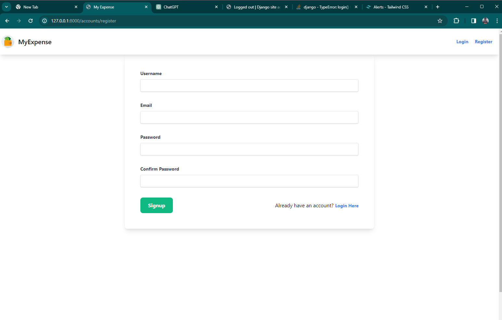
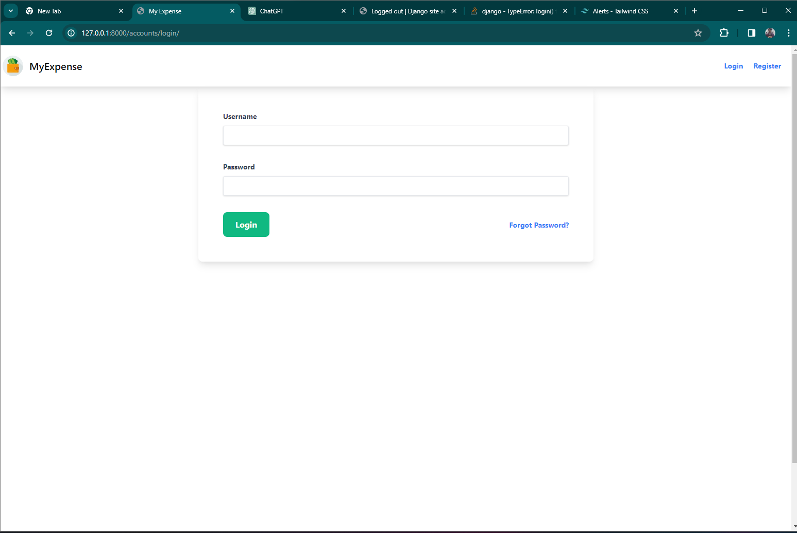
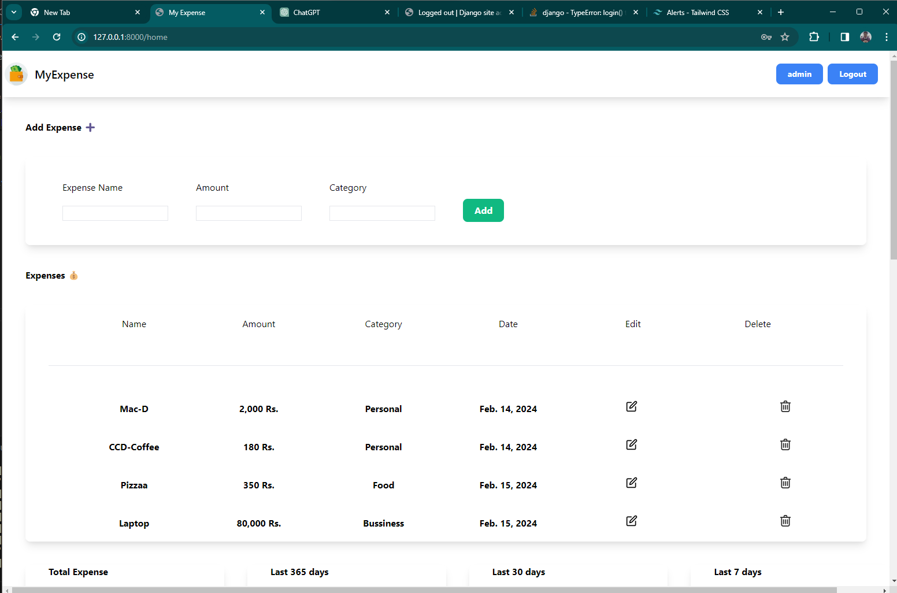
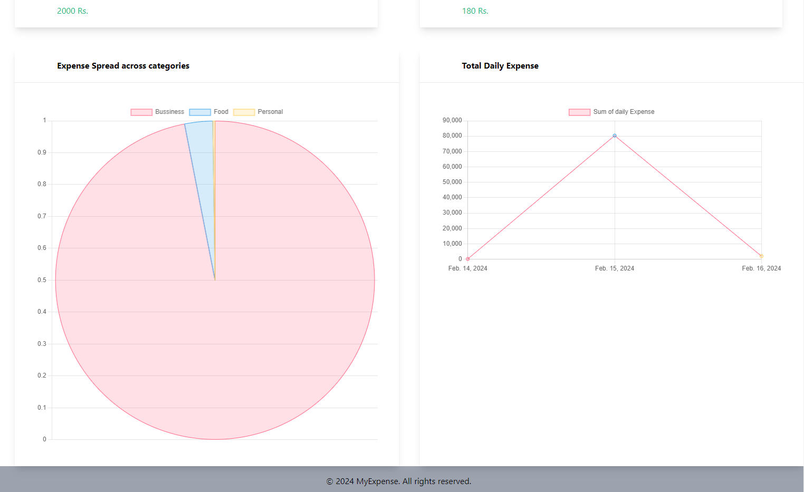
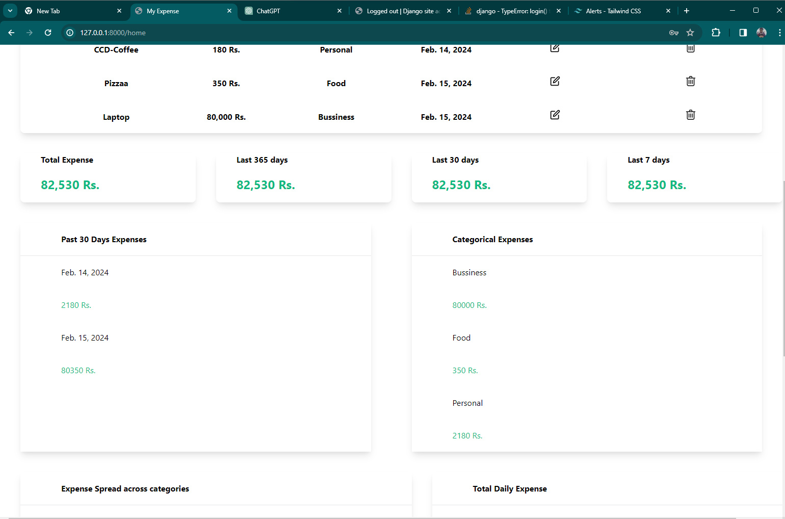
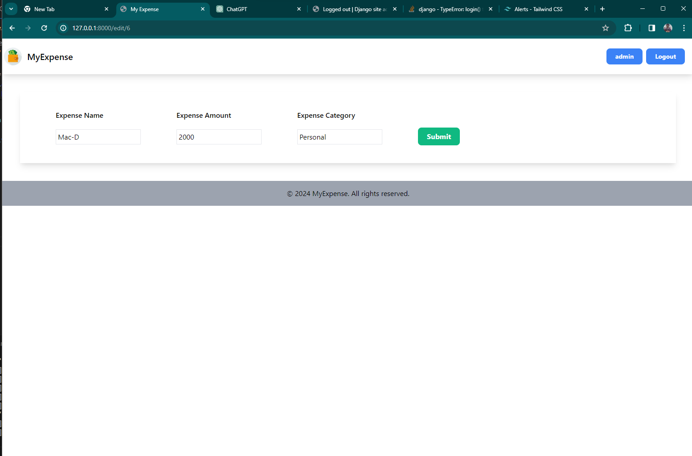

# MyExpense

This Django expense management application offers users a streamlined platform to monitor and control their expenditures effectively. Key features include:

1. **User Authentication**: Users can securely register, log in, and log out, ensuring data privacy and access control.

2. **Expense Management**: Authenticated users can seamlessly create, edit, and delete expenses, enabling efficient tracking and management of financial transactions.

3. **Expense Analysis**: The application provides valuable insights into expense data, including total expenses and breakdowns by various timeframes such as yearly, monthly, and weekly. Additionally, users can analyze expenses by day and category to gain deeper insights into their spending patterns.

4. **User Interface**: With intuitive templates and Django forms, users can easily navigate through different functionalities such as expense creation, editing, and deletion. Messages are displayed to provide feedback on successful or failed actions, enhancing the user experience.

5. **Security Measures**: Robust authentication mechanisms ensure that only authenticated users can access sensitive functionalities like expense management. Passwords are securely hashed and stored in the database to safeguard user accounts.

While the current implementation focuses on essential expense management functionalities and user authentication, future enhancements could include scalability mechanisms such as caching, asynchronous task processing, and horizontal scaling to ensure optimal performance and reliability as the application grows.

## Features

- Signup, Login and logout.
- authenticated user can add / edit / fetch and also delete all expenses using endpoints.
- authenticated User can visuallize thier expenses in the chart

---

## Requirement

- Python 3.X and virtual environment package
- PostgreSQL
- Web browser

---

## How to run Locally

1. make a directory and go to the directory
2. make a virtual environment <br>
   <b>a.</b> for windows
   ```bash
     python -m venv dev-env
   ```
   <b>b.</b> for unix & linux system
   ```bash
     python3 -m venv dev-env
   ```
3. Create the directory and inside the directory clone the project.
   ```bash
     git clone https://github.com/AbhiMisRaw/
   ```
4. Enable virtual environment<br>
   <b>a.</b> for windows
   ```bash
     dev-env\Scripts\activate
   ```
   <b>b.</b> for unix & linux system
   ```bash
     source dev-env/bin/activate
   ```
5. Go to the cloned project directory
   ```bash
     cd notes-codemonk-drf
   ```
6. Install dependencies

   ```bash
     pip install -r requirements.txt
   ```

7. Setup PostgreSQL Database database
8. Replace database configuration in manage.py file according to this
   ```bash
       DATABASES = {
       'default': {
           'ENGINE': 'django.db.backends.postgresql_psycopg2',
           'NAME': '<NAME OF YOU DATABASE>',
           'USER': '<USER NAME>',
           'PASSWORD': '<PASSWORD>',
           'HOST': '127.0.0.1',
           'PORT': '5432',
       }
   }
   ```
9. Run migrations
   ```bash
     python manage.py makemigrations
     python manage.py migrate
   ```
10. Start the server
    ```bash
      python manage.py runserver
    ```

---

## Database Structure

```bash

> Expense : Id, name, categories, amount, date, user
// We have used default user model so only required fields are mentioned for regsitration.
> User :  username, email, password

```

---

## Project Overview/Screenshot

- Registration
  
- Login
  
- Home
  
- Expense Chart
  
- Different Segment Expense
  
- Editing an Expense
  

## Support

For any support, email abhiimiishra@gmail.com
